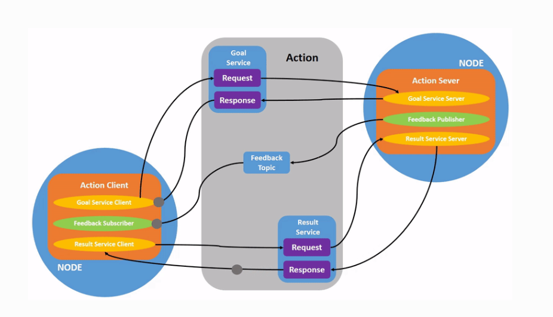

# nodes

## nodes

- ROS 中的每个节点都应负责单一的模块化功能
- 在 ROS 2 中，一个可执行文件（C++ 程序、Python 程序等）可以包含一个或多个节点

## 命令和操作

- run

```bash
ros2 run 软件包 文件名
```

- node list

  `ros2 node list` 会显示所有正在运行的节点的名称。当您想要与某个节点交互，或者您的系统运行着许多节点并需要跟踪它们时，这个命令尤其有用。

- #### Remapping

```bash
ros2 run turtlesim turtlesim_node --ros-args --remap __node:=my_turtle
```

* node info

  ```bash
  ros2 node info <node_name>
  ```

  `ros2 node info` 返回订阅者、发布者、服务和操作的列表，即与该节点交互的 ROS 图连接。


# 节点间的交互方式

- 话题-topics

- 服务-services

- 动作-Action

- 参数-parameters

  

## topics

- 主题是 ROS 图的重要组成部分，它们充当节点间交换消息的总线
- 一个节点可以向任意数量的主题发布数据，并同时订阅任意数量的主题

 **命令和操作**

-  rqt_graph

  - 可视化变化的节点和主题，以及它们之间的连接。

  - ```bash
    ros2 run rqt_graph rqt_graph
    ```

- list

  - ```bash
    ros2 topic list
    ```

- echo

  - ```bash
    ros2 topic echo <topic_name>
    ```

  - 查看某个主题已发布的数据

- info

  - ```bash
    ros2 topic info /turtle1/cmd_vel
    ros2 topic info /turtle1/cmd_vel --verbose //详细信息
    ```

- interface

  - 节点通过主题以消息的形式发送数据。发布者和订阅者必须发送和接收相同类型的消息才能进行通信。

  - ```bash
    ros2 interface show geometry_msgs/msg/Twist
    ```

- pub

  - ```bash
    ros2 topic pub <topic_name> <msg_type> '<args>'
    ```

  - `'<args>'` 参数是您将传递给主题的实际数据，

## service

- 服务是 ROS 图中节点间另一种通信方式。服务基于**呼叫-响应**模型，而非主题的发布-订阅模型。主题允许节点订阅数据流并持续获取更新，而服务**仅在客户端明确调用时才提供数据。**
- 

**命令和操作**

- list

  - ```bash
    ros2 service list
    ros2 service list -t //同时查看所有活动服务的类型

- 类型

  - ```
    ros2 service type <service_name>
    ```

- info

  - ```bash 
    ros2 service info <service_name>
    ros2 service info --verbose <service_name>
    ```

- find

  - ```bash 
    ros2 service find <type_name>

  - 要查找特定类型的所有服务

- interface

  - ```bash
    ros2 interface show <type_name>
    ```

- service call 

  - 调用服务

  - ```
    ros2 service call <service_name> <service_type> <arguments>
    ```

- service echo

  - ```bash
    ros2 service echo <service_name | service_type> <arguments>
    ```

  - 

## parameters

- parameter

  - 作用（配置结点）：ROS 2 中的参数与各个节点相关联。参数用于在启动时（以及运行时）配置节点，而无需更改代码。参数的生命周期与节点的生命周期绑定（尽管节点可以实现某种持久化机制，以便在重启后重新加载参数值）。

  - 参数的寻址方式：节点名称、节点命名空间、参数名称和参数命名空间。
    - 提供参数命名空间是可选的。

  - 组成： 每个参数由键、值和描述符组成
    - 键是字符串类型，值可以是以下类型之一： `bool` 、 `int64` 、 `float64` 、 `string` 、 `byte[]` 、 `bool[]` 、 `int64[]` 、 `float64[]` 或 `string[]` 。默认情况下，所有描述符均为空，但可以包含参数描述、值范围、类型信息和其他约束条件。

- 参数声明

  - 默认情况下，节点需要*声明*其生命周期内将要接受的所有参数。这样可以在节点启动时明确定义参数的类型和名称，从而降低后续配置错误的几率

- 参数类型

  - 预定义类型
    - ParameterType.PARAMETER_INTEGER：整数（如 42）
    - ParameterType.PARAMETER_DOUBLE：浮点数（如 3.14）
    - ParameterType.PARAMETER_STRING：字符串（如 "hello"）
    - ParameterType.PARAMETER_BOOL：布尔值（如 True/False）
    - ParameterType.PARAMETER_BYTE_ARRAY：字节数组（二进制数据）
    - 还有数组形式，如整数数组 [1, 2, 3]。
  - . 默认行为：运行时类型不可变
    - 默认规则：当您声明一个参数时（比如声明为整数），在节点运行期间（runtime），您不能通过工具（如 ros2 param set）或代码更改它的类型。这会失败，并报错。

- 参数回调

   - 理解： “回调”（Callback）是编程中的一个常见概念，指一种函数（或方法）作为参数传递给另一个函数，当特定事件或条件发生时，被自动调用执行。简单说，它像“等电话”：提供一个“电话号码”（回调函数），当“事件”来了（如按钮点击、数据到达），系统就“打电话”给你，让你处理。
   - 为什么用回调？
     - **异步处理**：不阻塞主程序，等事件触发再响应（高效）
     - **解耦**：调用者和被调用者不需紧耦合，灵活。
     - **常见场景**：GUI 事件（如点击按钮）、网络请求完成、定时器到期等。

   - 三种类型
     - **Pre-Set**：参数变化**之前**，可以修改即将设置的值（像“预处理”）
     - **Set**：参数变化**即将发生时**，检查并可能拒绝（像“审核”）
     - **Post-Set**：参数变化**成功后**，执行反应（像“后处理”）。

- 和参数交互：外部进程可以通过节点实例化时默认创建的参数服务执行参数操作


## actions

* 动作是通信类型之一，专为长时间运行的任务而设计。它们由三部分组成：目标、反馈和结果(a goal, feedback, and a result)
  * Actions 使用客户端-服务器模型，类似于发布者-订阅者模型（详见主题）。“Action 客户端”节点向“Action 服务器”节点发送目标，后者确认目标并返回反馈流和结果。

* 