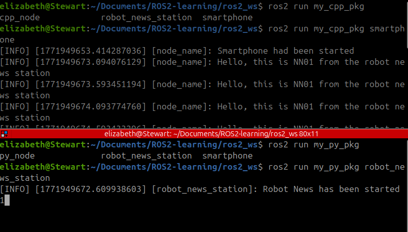

# publisher

> 更多查看： ./入门基础和介绍/节点和数据流

## 用python创建publisher

### 创建文件

- 工作目录
  - `ros2_ws/src/my_py_pkg`
- 创建节点
  - `touch +x robot_news_station.py`
- 赋予执行权限
  - `chmod +x robot_news_station.py`
  - **chmod**: Change Mode（改变模式）。
  - **+x**: 增加 **eXecutable**（可执行）权限。
- 进入src区进行编码
  - `cd ../..`
  - `code .`


### 编写节点

#### 节点代码

>  robot_news_station.py

- ```python
  #!/usr/bin/env python3  # 告诉系统这是一个 Python 脚本
  import rclpy           # ROS 2 的 Python 客户端库（核心库）
  from rclpy.node import Node  # 导入节点类，所有的功能都要写在“节点”里
  from example_interfaces.msg import String # 导入消息类型，我们要发的是“字符串”
  
  class RobotNewsStationNode(Node): 
      def __init__(self):
          # 初始化节点，并给它取名叫 "robot_news_station"
          super().__init__("robot_news_station")
  
          # 创建一个“发布者”（电台发射塔）
          self.publisher_ = self.create_publisher(
              String,       # 规定发送的消息类型是 String（文字）
              "robot_news", # 规定频道名称（Topic）叫 "robot_news"
              10            # 队列大小：如果发得太快，最多缓存10条消息
              )
  
          # 创建一个定时器：每 0.5 秒执行一次 self.publish_news 这个函数
          self.timer_ = self.create_timer(0.5, self.publish_news)
  
          # 在终端打印一条日志，告诉我们程序跑起来了
          self.get_logger().info("Robot News has been started")
  
      def publish_news(self):
          # 这里的逻辑是定时器触发后要做的事
          msg = String()      # 创建一个空白的 String 消息对象
          msg.data = "Hello"  # 给消息填入内容 "Hello"
          self.publisher_.publish(msg) # 真正把消息发送出去
  
  
  def main(args=None):
      rclpy.init(args=args)      # 1. 初始化 ROS 2 通信系统
      node = RobotNewsStationNode() # 2. 实例化我们上面写的那个类
      rclpy.spin(node)           # 3. 让程序进入“死循环”，等待定时器触发或处理事件,如果没有 spin，程序运行完 __init__ 就会直接退出，定时器永远不会触发。
      rclpy.shutdown()           # 4. 当我们手动关闭程序时，清理资源
  
  
  
  if __name__ == "__main()__":
      main() 
  ```

-  `self.publisher_ = self.create_publisher(msg_type, topic_name, qos_profile)`

  - publisher需要的第一个参数：消息类型

    - 消息类型

      - 可以使用标准的，也可以使用自己设计的类型
      - string类型的消息

      ```bash
      username:~/ros2_ws/src$ ros2 interface show example_interfaces/msg/String 
      # This is an example message of using a primitive datatype, string.
      # If you want to test with this that's fine, but if you are deploying
      # it into a system you should create a semantically meaningful message type.
      # If you want to embed it in another message, use the primitive data type instead.
      string data
      
      ```

    - import消息类型

      - `from example_interfaces.msg import String` 

      - package.xml文件增加dependencies

        - `  <depend>example_interfaces</depend>`

      - > [!note]
        >
        > 好习惯： 在import一个新的库的时候，确保在pkg文件下的package.xml 文件中添加新的<depend> </depend>

  - publisher需要的第二个参数：话题名称
    - 命名规范：小写 + 下划线， 层级结构可以加/
  - publisher需要的第三个参数：队列深度。 
    - 通常简单传一个整数，比如10
    - 代表暂存消息的大小
    - 工作逻辑
      - 假设你设置 `queue_size = 10`：
        - **先进先出 (FIFO)：** 就像排队买票，最先发出的消息会被最先处理。
        - **挤出旧消息：** 如果队列里已经存满了 10 条消息，而第 11 条新消息又来了，系统会**自动删掉最老的那条 (第 1 条)**，腾出位置给最新的。
    - 如果网络糟糕，或者消息很大，可以设置大一点

#### 一些代码conventions

- **OOP 封装**：强制使用 **类 (Class)** 继承 `Node`，而不是写面向过程的脚本。
- **回调机制 (Callback-driven)**：逻辑应由事件（定时器、消息到达）触发，而不是在 `while True` 循环里死等。
- **分离入口点**：`main` 函数仅负责生命周期管理（初始化、启动、销毁），业务逻辑全在类内部。
  - **理由**：为了解耦。这使得你的节点既可以作为一个独立脚本运行，也可以被其他更高级的程序（如 ROS 2 Launch 启动文件）直接调用。
- **成员变量后缀 (`_`)**：类内部的长期对象（如 `self.publisher_`）末尾加下划线，区分局部变量。
- **日志规范**：严禁 `print()`，统一使用 `self.get_logger().info()`。这便于在分布式系统中过滤和远程调试。
  - **理由**：机器人通常在后台运行或部署在远程机器上。`print` 只能在当前屏幕看，而 `logger` 可以远程抓取、存入数据库，并根据严重程度（如 ERROR）触发紧急制动。
- **话题命名**：Topic 名称（如 `robot_news`）通常使用全小写加下划线（snake_case）

- **QoS 默认值**：队列长度通常设为 `10`，这是一个在实时性和可靠性之间的折中惯例。
- **Spin 阻塞**：必须调用 `rclpy.spin()`，否则节点就像一个“没有电源的收音机”，虽然在那儿但不会工作。
- **消息实例化**：遵循“创建对象 -> 填充数据 -> 发布”的标准三步走，保持代码的可读性。

#### package.xml

- package.xml文件增加dependencies

  - `  <depend>example_interfaces</depend>`

 > [!note]
  >
  > 好习惯： 在import一个新的库的时候，确保在pkg文件下的package.xml 文件中添加新的<depend> </depend>

#### setup.py

- ```python
  entry_points={
      'console_scripts': [
          "py_node = my_py_pkg.my_first_node:main",
          "robot_news_station = my_py_pkg.robot_news_station:main",
      ],
  
  },
  ```

- entry_points

  - `entry_points` 是 ROS 2 的**“节点注册表”**
  - ROS 2 节点依赖很多复杂的库和环境变量。
    - **作用**：通过 `entry_points` 启动时，系统会自动帮你配置好 `PYTHONPATH`。这避免了你直接运行脚本时经常遇到的 `ImportError: No module named 'rclpy'` 报错。

- 填写规则

  - **`robot_news_station`** (等号左边)：这是**可执行文件名**。你以后在终端输入 `ros2 run 包名 robot_news_station` 就能启动程序。
  - **`my_package.robot_news_station`** (等号右边前半部分)：这是**路径**。告诉系统去 `my_package` 文件夹下找 `robot_news_station.py` 文件。
  - **`:main`** (冒号后面)：这是**入口函数**。告诉系统运行该文件里的 `main()` 函数。

#### colcon build

- 作用

  - 

  - | **动作**     | **简练说明**                                         | **为什么需要**                                               |
    | ------------ | ---------------------------------------------------- | ------------------------------------------------------------ |
    | **依赖校验** | 检查 `package.xml` 中的库是否齐全。                  | 防止程序运行到一半因缺少库（如 `rclpy`）而崩溃。             |
    | **命令注册** | 把 `setup.py` 里的入口转换成系统命令。               | 让你可以通过 `ros2 run` 直接启动，而不必输入长长的文件路径。 |
    | **空间隔离** | 将代码从 `src`（开发区）同步到 `install`（运行区）。 | 保持源代码干净，确保运行环境是经过“打包”后的稳定版本。       |
    | **格式编译** | 将 `.msg` 消息或 C++ 源码转换成二进制。              | 提高运行速度，并让不同语言（Python/C++）能听懂彼此说话。     |

- 文件目录： 在主目录下

- `rm -r build/ install log/`:当你搞乱了，就这么做

- `colcon build --packages-select my_py_pkg --symlink-install`

  - `colcon build`
    - 启动编译工作流（检查依赖、注册命令、搬运文件）
    - 如果只输入这个，它会尝试编译 `src` 文件夹下**所有**的包，非常耗时
  - `--packages-select my_py_pkg`
    - 只编译 `my_py_pkg` 这一个包，其他的包不要管
  - `--symlink-install`
    - 在 `install` 目录里创建一个指向 `src` 源码文件的快捷方式，而不是把文件**物理复制**过去
    - **不需要重新编译**，下次运行程序时它会自动读取最新的代码

#### 命名注意事项

- node名字：文件名（.py）, 节点类名（MyNode), setup.py文件的entry名字，一般都设置一样的
- topic名字： 是在create_publisher()里面命名的


## 用C++创建publisher

### 创建文件

- 目录： `ros2_ws/src/my_cpp_pkg/src`
- 创建文件：`touch robot_news_station.cpp`
- vscode目录： `ros2_ws/src`


### 编写节点

#### 节点代码

```cpp
#include "rclcpp/rclcpp.hpp"
#include "example_interfaces/msg/string.hpp"

using namespace std::chrono_literals;

class RobotNewsStationNode : public rclcpp::Node 
{
public:
    // 构造函数：初始化节点名和变量
    RobotNewsStationNode() : Node("robot_news_station"), robot_name_("R2D2")
    {
        // 创建发布者
        publisher_ = this->create_publisher<example_interfaces::msg::String>("robot_news", 10);
        
        // 创建定时器：0.5s 执行一次 publishNews
        timer_ = this->create_wall_timer(500ms, std::bind(&RobotNewsStationNode::publishNews, this));
        
        // 注意：get_logger 是方法，后面要加 ()
        RCLCPP_INFO(this->get_logger(), "Robot news station has been started");
    }

private:
    void publishNews() 
    {
        auto msg = example_interfaces::msg::String();
        msg.data = std::string("Hi, this is ") + robot_name_ + " from robot news station";
        publisher_->publish(msg);
    }

    std::string robot_name_;
    // 这里的 SharedPtr 就像 Python 的变量引用
    rclcpp::Publisher<example_interfaces::msg::String>::SharedPtr publisher_;
    rclcpp::TimerBase::SharedPtr timer_;
};

int main(int argc, char **argv)
{
    rclcpp::init(argc, argv);
    // 使用智能指针创建节点实例
    auto node = std::make_shared<RobotNewsStationNode>();
    rclcpp::spin(node);
    rclcpp::shutdown();
    return 0;
}
```

#### c++代码和python代码的对比和区别

| **维度**           | **Python (rclpy)**                         | **C++ (rclcpp)**                            | **C++ 核心逻辑拆解**                             |
| ------------------ | ------------------------------------------ | ------------------------------------------- | ------------------------------------------------ |
| **文件头**         | `import rclpy`                             | `#include "rclcpp/rclcpp.hpp"`              | C++ 需要“包含”头文件，类似导入模块               |
| **命名空间**       | `msg = String()`                           | `auto msg = std::make_shared<...String>()`  | C++ 用 `::` 表示层级，Python 用 `.`              |
| **类定义**         | `class MyNode(Node):`                      | `class MyNode : public rclcpp::Node`        | C++ 使用 `:` 表示继承，`public` 表示公开         |
| **构造函数**       | `def __init__(self):`                      | `MyNode() : Node("node_name")`              | C++ 冒号后接的是**初始化列表**，直接传参给父类   |
| **私有变量**       | `self._name = "R2"`                        | `std::string name_ = "R2";`                 | C++ 习惯在变量末尾加下划线 `_` 表示私有          |
| **创建 Publisher** | `self.create_publisher(Type, 'topic', 10)` | `this->create_publisher<Type>("topic", 10)` | `<Type>` 是**模板**，编译时就确定传输的数据类型  |
| **回调绑定**       | `self.timer_callback`                      | `std::bind(&MyNode::cb, this)`              | `std::bind` 把函数名和对象实例 `this` 捆绑在一起 |
| **日志打印**       | `self.get_logger().info("...")`            | `RCLCPP_INFO(this->get_logger(), "...")`    | C++ 里的 `RCLCPP_INFO` 是个**宏**，处理效率更高  |
| **消息发布**       | `pub.publish(msg)`                         | `pub_->publish(msg)`                        | `->` 符号意味着 `pub_` 是个指针（引用）          |
| **参数声明**       | `self.declare_parameter('p', 1)`           | `this->declare_parameter("p", 1);`          | 两者逻辑一致，但 C++ 语句末尾必须带 `;`          |
| **循环等待**       | `rclpy.spin(node)`                         | `rclcpp::spin(node);`                       | 基本一致                                         |
| **数据类型**       | 动态（随便改）                             | 静态（必须提前声明）                        | C++ 里的 `auto` 可以让编译器帮你猜类型           |

#### package.xml

- 添加

```xml
<depend>example_interfaces</depend>
```

#### CMakeList.txt

- 添加

- ```cmake
  # find dependencies
  find_package(example_interfaces REQUIRED)
  
  add_executable(robot_news_station src/robot_news_station.cpp)
  ament_target_dependencies(robot_news_station rclcpp example_interfaces)
  
  
  install(TARGETS
    cpp_node # exetable
    robot_news_station
    DESTINATION lib/${PROJECT_NAME} 
  )
  ```

  

#### package和CMakeList的区别

- | **特性**     | **package.xml**                                | **CMakeLists.txt**                             |
  | ------------ | ---------------------------------------------- | ---------------------------------------------- |
  | **主要角色** | 包管理器（rosdep, colcon）的指南               | 编译器（CMake）的脚本                          |
  | **关注点**   | **项目属性**（名称、版本、作者、外部依赖库名） | **编译流程**（可执行文件、头文件路径、库链接） |
  | **依赖声明** | 声明**软件包名称**（如 `example_interfaces`）  | 声明**具体的库文件/头文件**                    |
  | **典型语法** | `<depend>`, `<build_depend>`                   | `find_package()`, `add_executable()`           |
  | **重要性**   | 决定了你的包能否被系统识别和安装               | 决定了你的代码能否编译成功                     |


#### colcon build

- 命令行目录：`ros2_ws`
- `colcon build --packages-select my_cpp_pkg`
- ` source install/setup.bash`
- `ros2 run my_cpp_pkg  robot_news_station`
- `ros2 node list`
- `ros2 node info /robot_news_station `
- `ros2 topic echo /robot_news`


# subscriber

## 用python创建subscriber

### 创建文件

- 文件目录
  - `ros_ws/src/my_py_pkg/my_py_pkg/`
- 创建空白py文件
  - `touch smartphone.py`
  - `chmod +x smartphone.py`

### 编写代码

```python
#!/usr/bin/env python3
import rclpy
from rclpy.node import Node
from example_interfaces.msg import String

class SmartphoneNode(Node): 
    def __init__(self):
        super().__init__("smartphone") 
        self.subsriber_ = self.create_subscription(
            String, #消息类型，必须和publisher发送的消息类型一致
            "robot_news",#主题名称，必须和对应publisher的主题名字一致
            self.callback_robot_news, #回调函数，收到信息后做的事
            10 #队列大小
        )
        
        self.get_logger().info("Smartphone has been started")#初始化提示

    def callback_robot_news(self, msg:String):# explicit type
        #callback_topicname
        self.get_logger().info(msg.data) 

    
def main(args=None):
    rclpy.init(args=args)
    node = SmartphoneNode() 
    rclpy.spin(node)
    rclpy.shutdown()


if __name__ == "__main__":
    main
```

- 注意：setup.py 和package.xml文件和publisher一致


## 用CPP创建subcriber

### 创建文件

- 创建目录
  - `~/ros2_ws/src/my_cpp_pkg/src`
  - `touch ./smartphone.cpp`
- 编码工作区
  - `~/ros2_ws/src`

### 编写代码

#### 节点代码

- ```c++
  #include "rclcpp/rclcpp.hpp"
  #include "example_interfaces/msg/string.hpp"
  
  class SmartphoneNode : public rclcpp::Node 
  {
  public:
      SmartphoneNode():Node("node_name")
      {
          subscriber_ = this->create_subscription<example_interfaces::msg::String>(
              "robot_news",
              10,
              std::bind(&SmartphoneNode::callbackRobotNews, this, std::placeholders::_1));
          RCLCPP_INFO(this->get_logger(), "Smartphone had been started");
          
      }
  private:
      //callback func
      void callbackRobotNews(const example_interfaces::msg::String::SharedPtr msg)
      {
          RCLCPP_INFO(this->get_logger(),"%s", msg->data.c_str());
      }
  
      rclcpp::Subscription<example_interfaces::msg::String>::SharedPtr subscriber_;
  
  };
  
  int main(int argc, char **argv)
  {
      rclcpp::init(argc, argv);
      auto node = std::make_shared<SmartphoneNode>();
      rclcpp::spin(node);
      rclcpp::shutdown();
      return 0;
  }
  ```

- 一些容易出错的点提示

  - `example_interfaces`: 注意是s结尾
  - 回调函数的绑定 (`std::bind`)注意不要漏掉 `this` 指针或占位符 `_1`
  - `RCLCPP_INFO(..., "%s", msg->data.c_str())`
    - 是`RCLCPP_INFO`, 不是`rclcpp_info`, 也不是`RCLCPP.INFO
    - `.c_str()`:  `msg->data` 是 `std::string` 类型，而 C 语言风格的格式化打印 `%s` 需要的是 `const char*`。所以必须调用 `.c_str()
  - `std::make_shared\<SmartphoneNode\>()`
    - 注意尖括号 `< >` 里面是**类型名**，不需要圆括号
    - 否则触发编译错误（如 `sizeof` 失败）

#### CMakeList.txt

> Cmake三部曲
>
> - find_package() : #include库的时候用
>
> - 添加目标信息
>
>   - `add_executable(node_name src/srcfile.cpp)`
>   - `ament_target_dependencies (node_name dependencies_name1 dependencies_name2 dependencies_name3 ...) `
>
> - 添加install信息
>
>   - ```cmake
>     install(TARGETS
>       node_name
>       DESTINATION lib/${PROJECT_NAME}
>     )
>     ```


- 配置文件

```cmake
cmake_minimum_required(VERSION 3.8)
project(my_cpp_pkg)

# 1. 寻找编译器标志 (如果是 C++)
if(NOT CMAKE_CXX_STANDARD)
  set(CMAKE_CXX_STANDARD 17)
endif()

# 2. 寻找必要的 ROS 2 依赖包
find_package(ament_cmake REQUIRED)
find_package(rclcpp REQUIRED)
find_package(example_interfaces REQUIRED)

# 3. 声明可执行文件
# 格式：add_executable(目标名 源文件路径)
add_executable(smartphone_node src/smartphone.cpp)

# 4. 将依赖包关联到你的目标文件
# 这能自动处理包含目录 (Include) 和库链接 (Link)
ament_target_dependencies(smartphone_node
  rclcpp
  example_interfaces
)

# 5. 设置安装路径 (如果不写这一块，ros2 run 将找不到你的节点)
install(TARGETS
  smartphone_node
  DESTINATION lib/${PROJECT_NAME}
)

# 6. 打包宏，必须放在最后
ament_package()
```


#### package.xml

`<depend> 库名 </depend> `

### 运行代码

- build: `colcon build --packages-select my_cpp_pkg`
- `ros2 run pkg node`,结果如下



- 注意我的发布者是python语言,订阅者是cpp.说明这是不依赖语言（Language-Agnostic）的

