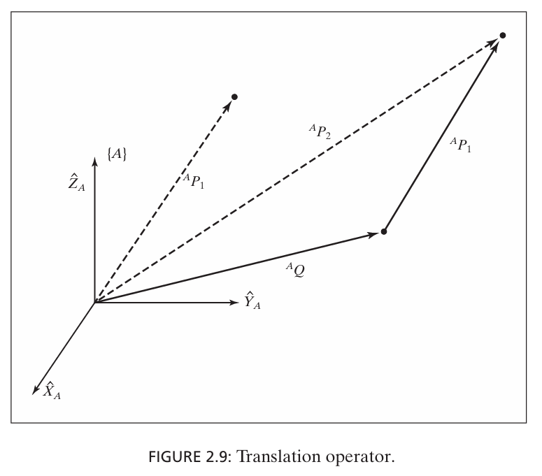
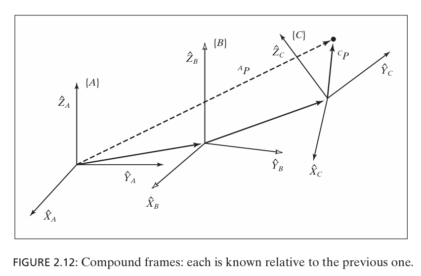
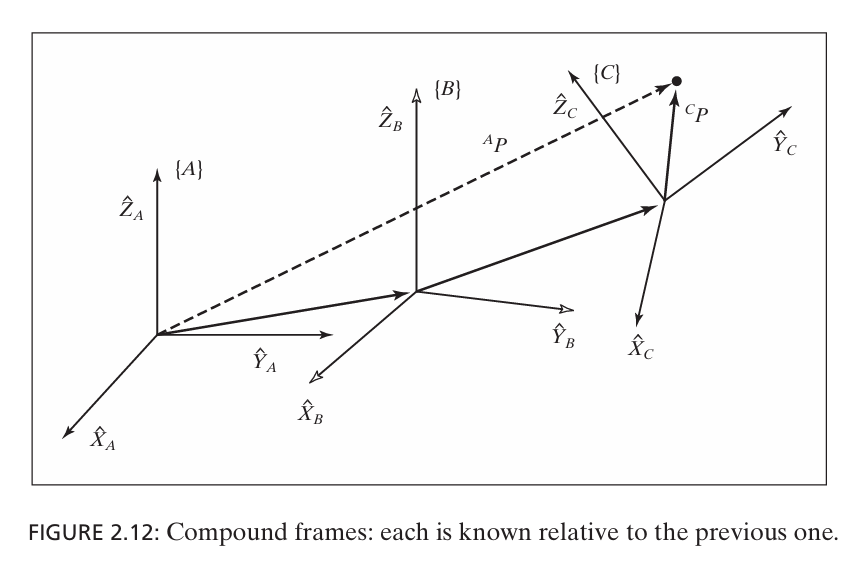
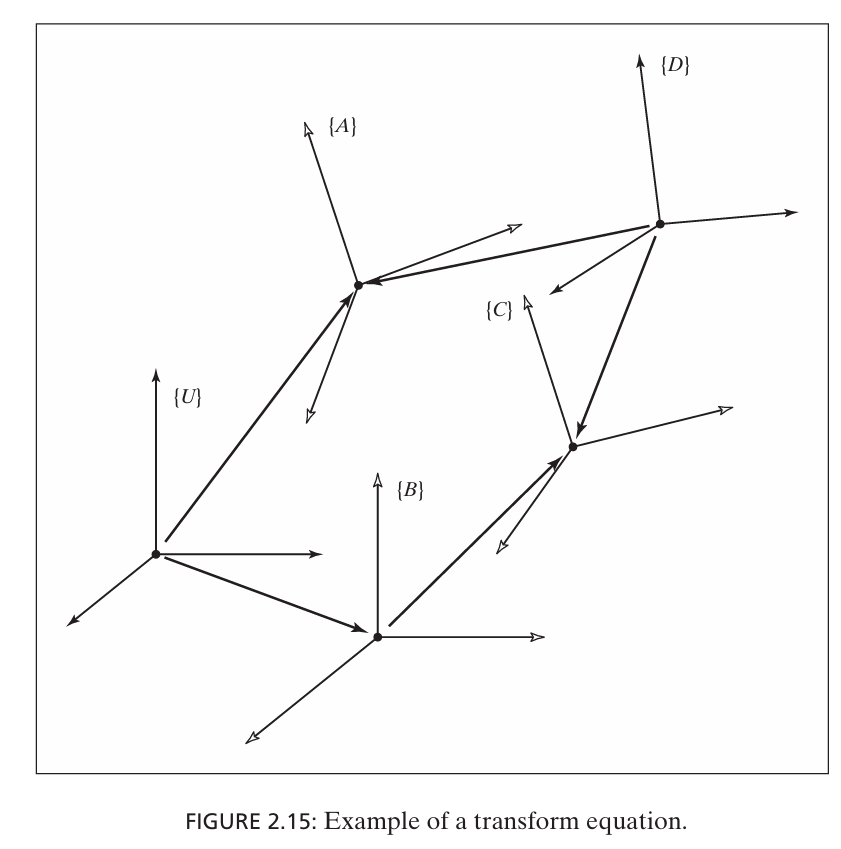
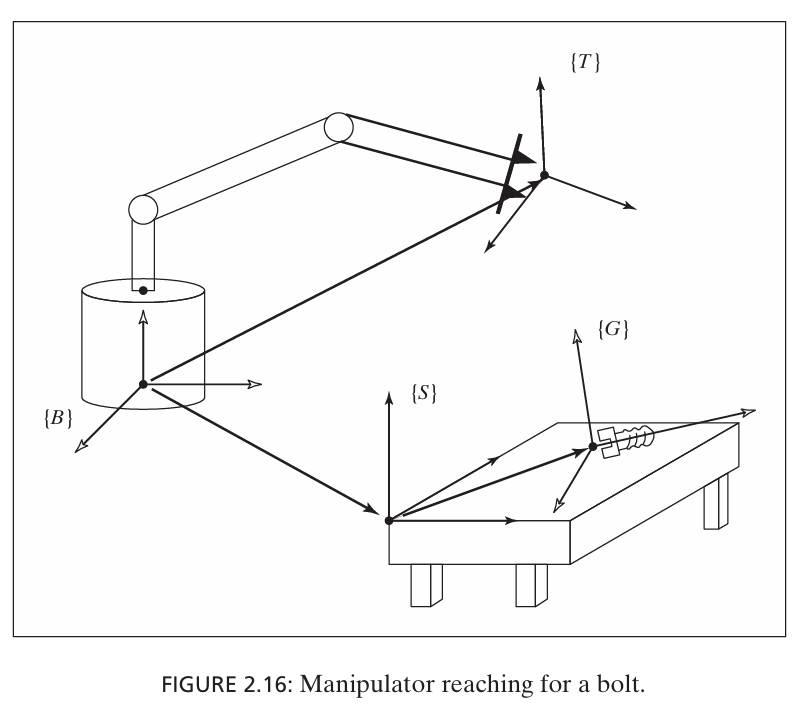

# 位置和姿态

## 位置（Position)表示方法

在A坐标系$\{A\}$中，P 的位置矢量
$$
^AP= \begin{bmatrix} x\\y\\z  \end{bmatrix}
$$

## 姿态（Orientation）

### 姿态的本质：坐标系之间的关系

当我们谈论一个物体的姿态时，实际上是在描述**物体坐标系 $\{B\}$** 相对于 **参考坐标系 $\{A\}$** 的旋转关系。

- **平移 (Translation)**：决定了坐标系原点的重合程度。

- **旋转 (Rotation)**：决定了坐标系各个轴（$x, y, z$​）之间的夹角。

  

## 姿态表示方法

### 旋转矩阵

* 通过一个 $3 \times 3$ 的正交矩阵来描述坐标系相对于参考坐标系的旋转

$$
^A_BR = \begin{bmatrix} ^A\hat{X}_B & ^A\hat{Y}_B & ^A\hat{Z}_B \end{bmatrix} = \begin{bmatrix} ^B\hat{X}_A^T \\ ^B\hat{Y}_A^T \\ ^B\hat{Z}_A^T \end{bmatrix} = \begin{bmatrix} r_{11} & r_{12} & r_{13} \\ r_{21} & r_{22} & r_{23} \\ r_{31} & r_{32} & r_{33} \end{bmatrix}
$$

- 公式含义
  - $\hat{X}_B，\hat{Y}_B，\hat{Z}_B$：表示{B}坐标系主轴的单位矢量
  - $^A\hat{X}_B，^A\hat{Y}_B，^A\hat{Z}_B$: 表示{B}坐标系主轴的单位矢量在坐标系{A}中的表示

- 关键特性

  - 坐标转换

    - 如果知道一个点在 $\{B\}$ 坐标系里的位置 $^BP$，想要求它在 $\{A\}$ 里的位置 $^AP$​，公式如下：

      - $$
        ^AP = {^A_BR} \cdot {^BP}
        $$

  - 逆向推导（转置即逆）

    - 想要求“$A$ 相对于 $B$​”的姿态，不需要做复杂的矩阵求逆，只要把矩阵的行和列互换一下位置就行了

      - $$
        {^A_BR}^{-1} = {^A_BR}^T = {^B_AR}
        $$

        

- 优缺点

  - **优点**：没有奇异点；便于坐标变换（向量直接左乘矩阵）。

  - **缺点**：使用了 9 个变量表示 3 个自由度，存在冗余；计算量较大且必须满足正交约束（$R^T R = I$ 且 $\det(R) = 1$）

###  欧拉角 (Euler Angles)

- 通过绕三个互相垂直的轴进行三次连续旋转来表示姿态。常见的有 Z-Y-X 顺序（通常称为偏航-俯仰-翻滚，Yaw-Pitch-Roll）

- **表示方式**：$(\alpha, \beta, \gamma)$。

  **优点**：符合人类直觉，仅需 3 个参数。

  **缺点**：存在**万向节死锁 (Gimbal Lock)** 问题（当中间一个旋转角度为 90° 时，会丢失一个自由度，即所谓的奇异性）。

## 位姿frame

### 表示方法

$$
{B}={^A_BR,^AP_{BORG}}
$$

- $^A_BR$: 旋转矩阵
- $^AP_{BORG}$: 位姿{B}的原地的位置矢量
  - **BORG**：Frame {B} 的原点 (Origin of Frame B

# 映射：坐标系变换

## 平移映射（Translated Frames）

当两个坐标系 $\{A\}$ 和 $\{B\}$ 的**姿态完全相同（两个坐标系 $\{A\}$ 和 $\{B\}$ 的坐标轴是完全平行且指向一致的）**，**仅存在位置偏离时**，我们使用向量加法来进行转换。

- **已知条件**：点在 $\{B\}$ 中的坐标 $^BP$，以及 $\{B\}$ 的原点在 $\{A\}$ 中的位置 $^AP_{BORG}$。

- **计算公式**：
  $$
  ^AP = {^BP} + {^AP_{BORG}}
  $$

- 旋转矩阵必然是单位矩阵：
  $$
  ^A_BR = I_3 = \begin{bmatrix} 1 & 0 & 0 \\ 0 & 1 & 0 \\ 0 & 0 & 1 \end{bmatrix}
  $$
  

- **注意**：向量的加法只有在“**坐标轴平行且单位长度一致**”的基准下才有物理意义。

------

## 旋转映射（Rotated Frames）

当两个坐标系的原点重合，但**姿态（角度）不同**时，我们使用旋转矩阵 $^A_BR$ 进行映射。

- **数学本质**：旋转矩阵的每一行其实是 $\{A\}$ 的单位轴在 $\{B\}$ 中的表达。将 $^BP$ 与这些行向量做点积，本质上是将点投影到 $\{A\}$ 的坐标轴上。

- **计算公式**：

  - 位置矢量

  $$
  ^AP = {^A_BR} \cdot {^BP}
  $$

  - 位置分量

    - 矩阵乘法分解就行了

    $$
    ^AP_x = {^B\hat{X}_A} \cdot {^BP}
    $$

## 一般映射

- 复合映射的简单逻辑

  - **旋转**：使用旋转矩阵 $^A_BR$ 将 $^BP$ 转换到与 $\{A\}$ 方向一致的中间状态。此时得到的向量是点 $P$ 相对于 $\{B\}$ 原点、但在 $\{A\}$ 坐标系下的方向表达。

  - **再平移**：通过简单的向量加法，加上 $\{B\}$ 原点相对于 $\{A\}$ 的位置向量 $^AP_{BORG}$。

  - **通用公式 **：
    $$
    ^AP = {}^A_BR {}^BP + {}^AP_{BORG}
    $$
    

- **齐次变换矩阵（Homogeneous Transform）**

  - 数学形式的简化

    - 原来的

      - $$
        ^AP = {}^A_BR {}^BP + {}^AP_{BORG}
        $$

    - 现在的

      - $$
        ^AP = {}^A_BT {}^BP
        $$

  - 实现方式

    - $$
      \begin{bmatrix} 
      ^A P \\ 
      1 
      \end{bmatrix} = 
      \left[ \begin{array}{ccc|c} 
      & & & \\
      & ^A_B R & & ^A P_{BORG} \\
      & & & \\ \hline
      0 & 0 & 0 & 1 
      \end{array} \right] 
      \begin{bmatrix} 
      ^B P \\ 
      1 
      \end{bmatrix}
      $$

# 算子operators

## 平移算子 (Translational Operators)

平移算子将一个点 $^AP_1$ 沿着某个向量 $Q$ 移动到新位置 $^AP_2$。

- **数学表达**：
  $$
  ^AP_2 =^AP_1+^AQ=D_Q(q) {}^AP_1
  $$

  - 算子解释$D_Q(q)$
    - q:  q is the signed magnitude of the translation along the vector direction $\hat{Q}$

- **矩阵结构**：它是一个特殊的齐次变换矩阵，旋转部分是单位矩阵 $I$，第四列则是平移向量 $(q_x, q_y, q_z)$​。
  $$
  D_Q(q) = \begin{bmatrix} 1 & 0 & 0 & q_x \\ 0 & 1 & 0 & q_y \\ 0 & 0 & 1 & q_z \\ 0 & 0 & 0 & 1 \end{bmatrix}
  $$

  - 理解： 由于只有平移，所以旋转矩阵是单位矩阵

  - 图示：

    

  ​	

------

##  旋转算子 (Rotational Operators)

旋转算子将向量 $^AP_1$ 绕某个轴旋转 $\theta$ 度，得到新向量 $^AP_2$。

- **符号$R_K(\theta)$**：

  - K:  绕K轴旋转
  - $\theta$:  旋转角度
  - 可以是3\*3, 也可以是4\*4

- **Z 轴旋转算子 **：
  $$
  R_z(\theta) = \begin{bmatrix} \cos\theta & -\sin\theta & 0 & 0 \\ \sin\theta & \cos\theta & 0 & 0 \\ 0 & 0 & 1 & 0 \\ 0 & 0 & 0 & 1 \end{bmatrix}
  $$
  

- **重要结论**：旋转向量 $R$ 的矩阵，与描述一个相对于参考系旋转了 $R$ 的“坐标系”的旋转矩阵是**完全一样**的。

------

##  变换算子 (Transformation Operators)

这是平移和旋转的结合。它在一个坐标系内，将一个点旋转后再平移。

- **通用公式**：
  $$
  ^AP_2 = T {}^AP_1
  $$

- **对比映射和算子**：

  - **映射**：点在空间没动，我们求它在搬移后的新坐标系 $\{B\}$ 里的描述。
  - **算子**：坐标系 $\{A\}$ 没动，我们把点 $P_1$ 旋转并平移到了新位置 $P_2$。
  - **结论**：虽然两者的数学计算过程（数字）完全一样，但**物理意义截然不同**。

# 变换的计算

## 复合变换 (Compound Transformations)

如果你知道 $\{C\}$ 相对于 $\{B\}$ 的位置，也知道 $\{B\}$ 相对于 $\{A\}$ 的位置，你想直接求 $\{C\}$ 相对于 $\{A\}$ 的位置：

- **计算逻辑**：连续进行矩阵乘法。

- **公式**：

  - $$
    {}^A_C T = {}^A_B T {}^B_C T
    $$

  - 推导过程

    - $${}^B P = {}^B_C T {}^C P \quad$$
    - $${}^A P = {}^A_B T {}^B P  $$
    - $${}^A P = {}^A_B T {}^B_C T {}^C P $$

- 图示： 

------

##  变换矩阵的逆 (Inverting a Transform)

已知 ${}^A_B T$，想求反方向的 ${}^B_A T$​。

- 目标：已知坐标系 $\{B\}$ 相对于 $\{A\}$ 的描述 ${}^A_B T$（包含旋转 ${}^A_B R$ 和平移 ${}^A P_{BORG}$），我们需要求出反向的描述，即 $\{A\}$ 相对于 $\{B\}$ 的描述 ${}^B_A T$

- **逆变换矩阵**：不需要通用求逆

  - $$
    {}^B_A T = {}^A_B T^{-1} = \left[ \begin{array}{ccc|c} 
     & & & \\
     & {}^A_B R^T & & -{}^A_B R^T {}^A P_{BORG} \\
     & & & \\ \hline
     0 & 0 & 0 & 1 
    \end{array} \right]
    $$

  - **旋转部分**：直接转置，${}^B_A R = {}^A_B R^T$。

  - **位置部分**：${}^B P_{AORG} = -{}^A_B R^T {}^A P_{BORG}$​。

  - 公式推导

    - 旋转矩阵作为正交矩阵
      - $${}^A_BR = {}^B_AR^{-1} = {}^B_AR^T \quad \text{}$$
    - 在 $\{B\}$ 的坐标系里，求$\{A\}$ 的原点： $^BP_{AORG}$
      - 把点 $P$ 选在 **$\{A\}$​ 的原点**上
      - 在 $\{A\}$ 看来，自己的原点坐标就是 $0$，所以等式左边 ${}^A P = 0$
      - 在 $\{B\}$ 看来，$\{A\}$ 的原点坐标就是我们要找的未知数 ${}^B P_{AORG}$
      - 通用映射公式：
        - $^AP = {}^A_B R {}^B P + {}^A P_{BORG}$​。
      - 所以求得$^BP_{AORG}$
        - $$0 = {}^A_B R \cdot {}^B P_{AORG} + {}^A P_{BORG}$$
        - $${}^B P_{AORG} = -{}^A_B R^T \cdot {}^A P_{BORG}$$​
    - $^B_AT$矩阵: 是按照他的物理意义填入的

- **物理意义**：这实现了从“从 $A$ 看 $B$”到“从 $B$ 看 $A$​”的视角切换。

- 图片

  - 

------

##  变换方程 (Transform Equations)

这是解决机器人实际问题的最常用方法。如果从起点 $\{U\}$ 到终点 $\{D\}$ 有两条不同的路径，那么这两条路径的变换矩阵乘积一定相等。

- **闭环原则**：${}^U_A T {}^A_D T = {}^U_B T {}^B_C T {}^C_D T$。
- **解未知量**：如果方程中只有一个矩阵是未知的（比如我们要算机械臂该怎么动才能抓到螺栓），可以通过移项（乘以逆矩阵）来求解。
- 图示
  - 

------

### 实例应用：抓取螺栓

- **已知信息**：
  - 
  - 机械臂末端相对于基座的位置 ${}^B_T T$。
  - 桌子相对于基座的位置 ${}^B_S T$。
  - 螺栓相对于桌子的位置 ${}^S_G T$。
- **目标**：求螺栓相对于机械臂末端（手部）的位置 ${}^T_G T$（这样机器人才能知道怎么伸手去抓）。
- 公式：${}^T_G T = {}^B_T T^{-1} {}^B_S T {}^S_G T$。
  - 先求逆回到基座，再经过桌子，最后到达螺栓

# 计算考虑

## 齐次矩阵

虽然 **齐次变换矩阵 $T$** 是一个很好的概念工具，但工业机器人软件通常**不会**直接进行 $4 \times 4$ 矩阵的通用乘法。

- **原因**：$4 \times 4$ 矩阵的最后一行始终是 $[0, 0, 0, 1]$。如果执行通用乘法，计算机会浪费大量时间去算 $0 \times x$ 或 $1 \times y$。
- **做法**：工程师通常会手动编写公式，**先做 $3 \times 3$ 的矩阵乘法，再做向量加法。**

------

## 结合顺序（Order of Operations）的重要性

假设我们要将一个点 $P$ 经过三次旋转变换，计算 $^AP = {}^A_B R {}^B_C R {}^C_D R {}^D P$。这里有两种计算策略：

#### 策略 A：先算矩阵（Matrix-Matrix First）

先将三个 $3 \times 3$ 旋转**矩阵连乘**，得到一个总的 ${}^A_D R$。

- **代价**：
  - 两次矩阵乘法：$2 \times 27 = 54$ 次乘法，$2 \times 18 = 36$ 次加法。
  - 一次矩阵与向量乘法：$9$ 次乘法，$6$ 次加法。
- **总计**：**63 次乘法，42 次加法**。

#### 策略 B：先算向量（Matrix-Vector First）

**从右向左**，先让向量乘以最右边的矩阵，得到一个中间向量，再依次向左乘。

- **代价**：
  - 三次矩阵与向量乘法：$3 \times 9 = 27$ 次乘法，$3 \times 6 = 18$ 次加法。
- **总计**：**27 次乘法，18 次加法**。

**结论**：如果只转换**一个点**，策略 B 的速度比策略 A 快一倍以上。但如果有一万个点需要转换，则应该先算出总矩阵（策略 A），然后重复使用。

------

## 利用几何特性的优化

如果你必须计算两个旋转矩阵的乘积 ${}^A_B R {}^B_C R$，最暴力的方法需要 27 次乘法。但利用**旋转矩阵的性质**，可以进一步优化：

旋转矩阵的第三列总是前两列的**外积（叉乘）**：$\hat{C}_3 = \hat{C}_1 \times \hat{C}_2$。

1. 计算前两列：$2 \times 9 = 18$ 次乘法。
2. 通过叉乘计算第三列：$6$ 次乘法。

- **优化后**：只需 **24 次乘法**。

------

##  总结：代码开发习惯

在编写机器人算法代码时：

1. **避免不必要的 0 和 1 运算**。
2. **根据任务量决定结合方向**：转换的点少，用向量连乘；转换的点多，先求合成矩阵。
3. **利用正交性**：如果计算出的旋转矩阵因为**浮点数误差**不再正交，**需要进行归一化处理**（通常使用 Gram-Schmidt 过程）。